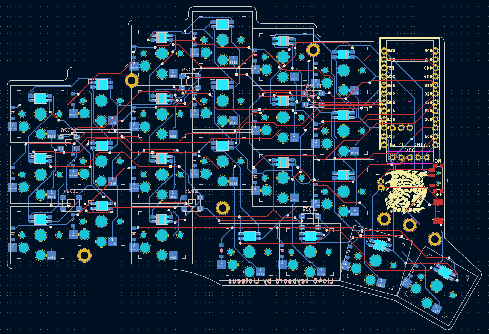
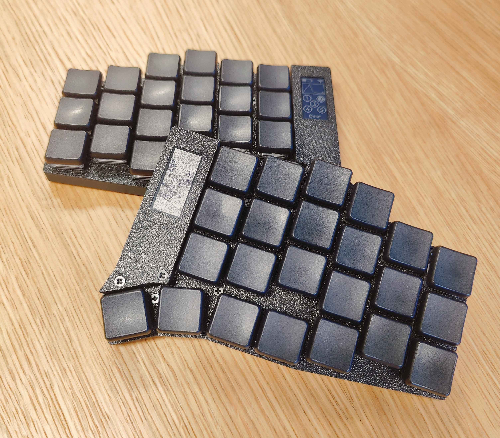
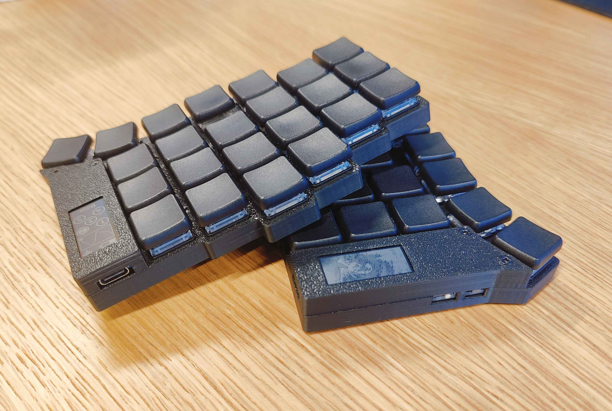

# Lio46 V2

Lio46 is a wireless, 46 key keyboard with my personal best layout in mind.  

# Notable features
- Wireless split keyboad
- 46 keys (23 per side), 4 thumb keys, one extra key on ring column
- Hot-swappable low profile kailh choc v1 switches
- Column staggered with aggressive pinky stagger
- Powered by [ZMK](https://zmk.dev/)
- Generated with [ergogen](https://github.com/ergogen/ergogen) 

more pictures [here](https://github.com/Liolaeus/lio46/tree/master/pictures) !

# V2 Changelog
- Removed underglow and backlight leds for better battery life
- Moved the thumb keys inwards
- Manual routing
- Fixed logo placement on the pcb
- Moved srew/standoff holes
- Trimmed edges of pcb
- Moved battery connector
- Added a case
- Moved key and display pins
- Supports E-ink nice view displays

# Firmware
You can find and modify the ZMK firmware for this keybaord [here](https://github.com/Liolaeus/lio46-zmk-config).

# Requirements
If you want to modify this keyboard here is the list of software dependencies to run all the scripts in this repository:

- GNU make
- ergogen
- kicad 8
- docker
- python

# Parts
If you want to build this keyboard, you can find all the parts [here](https://github.com/Liolaeus/lio46/blob/master/parts.md)

# References
A list of projects and tools that were used and/or taken inspiration from for the creation of this project, many thanks to all of them.

- [ZMK Firmware](https://zmk.dev/)
- [Sofle ZMK config](https://github.com/zmkfirmware/zmk/tree/0820991901a95ab7a0eb1f1cc608a631d514e26c/app/boards/shields/sofle)
- [Ergogen](https://github.com/ergogen/ergogen)
- [Freerouting](https://github.com/freerouting/freerouting)
- [Flatfootfox blog](https://flatfootfox.com/ergogen-part1-units-points/)
- [SpUnLy58 keyboard](https://github.com/Giraffasax/SpUnLy58/tree/main)
- [Corney-island keyboard](https://github.com/ceoloide/corney-island)
- [NostrumX keyboard](https://github.com/bennytrouser/NostrumX/tree/main)
- [Caldera keyboard](https://github.com/christianselig/caldera-keyboard/tree/main)
- [Avalanche keyboard](https://github.com/vlkv/avalanche/tree/master)
