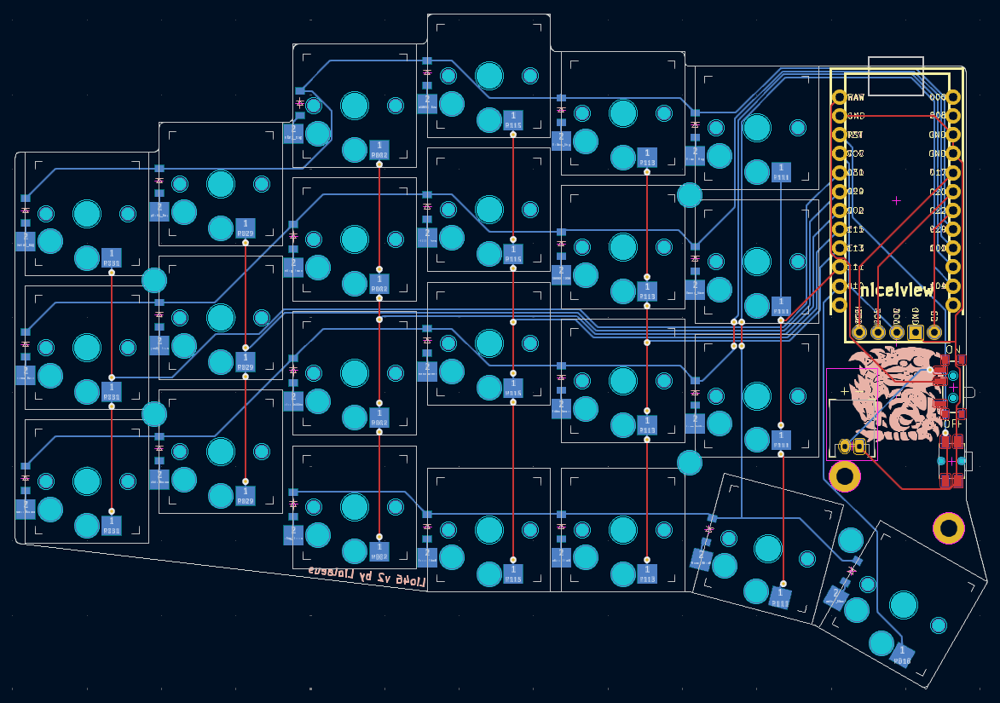

# Lio46 keyboard
`Warning: this is still a work in progress.`

The Lio46 is a wireless, 46 key keyboard with my personal best layout in mind.  

# Notable features
- Wireless split keyboad
- 46 keys (23 per side), 4 thumb keys, one extra key on ring column
- Hot-swappable low profile kailh choc v1 switches
- Column staggered with aggressive pinky stagger
- Per key backlight and underglow
- Powered by [ZMK](https://zmk.dev/)
- Generated with [ergogen](https://github.com/ergogen/ergogen) 
- Routed with the help of [freerouting](https://github.com/freerouting/freerouting)

# Requirements
If you want to modify this keyboard here is the list of software dependencies to run all the scripts in this repository:

- GNU make
- ergogen
- kicad 8
- docker
- python

# Parts
If you want to build this keyboard, you can find all the parts [here](https://github.com/Liolaeus/lio46/blob/master/parts.md)

# Issues / Todolist
This project is not finished and still has a lot improvements to do, here is a non exhaustive list of things that could be improved:

- better component labelling on the pcb
- automate pcb logo and text placement
- automate the arc on the bottom of the board
- [freerouting does not route everything](https://github.com/freerouting/freerouting/issues/367)
- [freerouting ignores number of passes](https://github.com/freerouting/freerouting/issues/376)
- manual PCB routing, and ground plane
- move thumb keys closer to the inside of the board
- larger screw holes to let standoffs go through the pcb (between switch plates and backplate)
- move screw holes closer to the edges of the board
- move left logo to the back of the pcb
- trim boders of the pcb to get closer to the keycaps outline
- eventually: make the pinky column removable from the pcb

# References
A list of projects and tools that were used and/or taken inspiration from for the creation of this project, many thanks to all of them.

- [ZMK Firmware](https://zmk.dev/)
- [Sofle ZMK config](https://github.com/zmkfirmware/zmk/tree/0820991901a95ab7a0eb1f1cc608a631d514e26c/app/boards/shields/sofle)
- [Ergogen](https://github.com/ergogen/ergogen)
- [Freerouting](https://github.com/freerouting/freerouting)
- [Flatfootfox blog](https://flatfootfox.com/ergogen-part1-units-points/)
- [Giraffasax keyboard](https://github.com/Giraffasax/SpUnLy58/tree/main)
- [Corney-island keyboard](https://github.com/ceoloide/corney-island)
- [NostrumX keyboard](https://github.com/bennytrouser/NostrumX/tree/main)
- [Caldera keyboard](https://github.com/christianselig/caldera-keyboard/tree/main)
- [Avalanche keyboard](https://github.com/vlkv/avalanche/tree/master)
